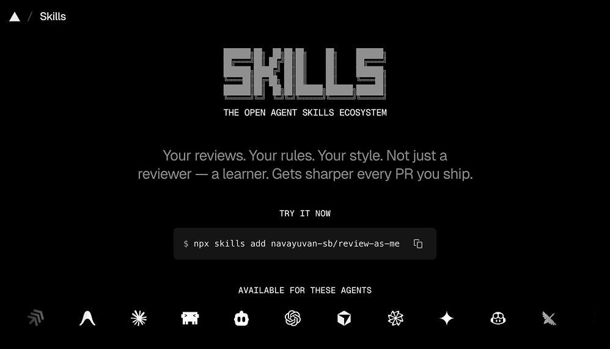
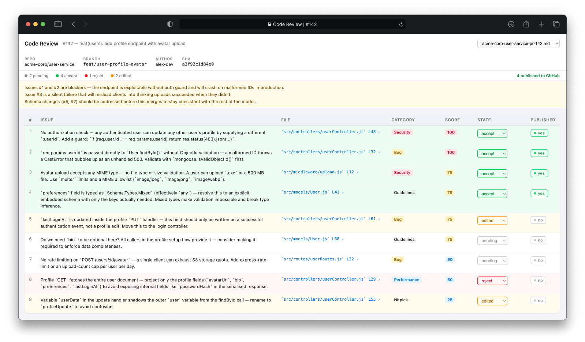

<div align="center">

# review-as-me

A Claude Code skill that reviews PRs in your personal style — and gets sharper every time you use it.


</div>

---

<div align="center">



</div>

---

## Setup

```bash
npx skills add Navayuvan-SB/review-as-me
```

## Features

### Reviews like you
Reads your personal `review-guidelines.md` and applies every rule to the diff. Flags violations with the exact rule quoted.

### The more PRs you review, the sharper it gets
After each review, the skill analyses new patterns you flagged, false positives that reveal gaps in the rules, and tone/phrasing from your actual comments. It proposes specific additions, edits, or removals to your guidelines — one at a time, never batch-applied without your approval.

### Parallel agents, every review
Simultaneously audits for guideline violations, logic bugs, git history context, patterns from past PR comments on the same files, and code comment compliance. Nothing slips through a single reviewer's blind spot.

### Scored and filtered
Every issue is scored 0–100 and filtered against a configurable threshold so you only see signal, not noise.

### Posts inline, never top-level
When you approve, comments land as inline GitHub review comments at the exact line, not as a wall of text.

### Threshold auto-calibration
Your feedback ("this was noise", "you missed this") nudges the score threshold up or down after each session. Over time, the skill gets quieter or louder to match your signal tolerance.

### Local review UI
Browse, triage, and publish saved reviews from a local web UI. Edit issue text inline, toggle states, and publish comments to GitHub with one click.

## Usage

In any Claude Code session, say:

```
review this PR as me: <github-pr-url>
```

or just:

```
review as me: <owner/repo>#<number>
```

## Review UI



- Browse all saved review files
- Change issue state (`pending` → `accept` / `reject` / `edited`)
- Double-click any issue text to edit it inline
- One-click publish toggle (irreversible — synced with GitHub state)
- URL reflects the selected file for easy bookmarking

## Score thresholds

| Score | Meaning |
|-------|---------|
| 100 | Definitely real, confirmed, happens frequently |
| 75 | Verified real, important, directly in guidelines |
| 50 | Verified real but minor/nitpick |
| 25 | Might be real but unverified; stylistic |
| 0 | False positive or pre-existing |

The threshold auto-adjusts between 30 and 85 based on your feedback after each session.
